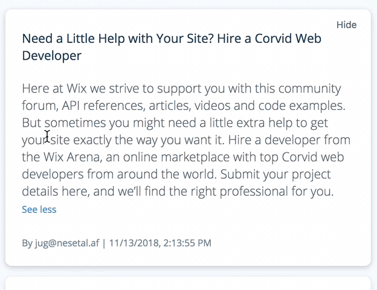

# Shift FED Exam

Hi there!  
In this exam you will extend and add new features to a simplified security issues management system.
The task's main purpose is to test your ability to learn new topics and deliver high quality digital products. It combines building UI components and a touch of server development as well.

## Prerequisites

- [Node.js](https://nodejs.org/) 20 or higher
- npm 9 or higher
- Git
- A [GitHub](https://github.com) account

## Getting Started

1. Go [here](https://github.com/new/import) and import this repository into your account. Make sure to select the **private** option
2. [Clone](https://try.github.io/) your new repository to your computer
3. Install dependencies: `npm install`
4. Set up the .env file: `cp .env.example .env`
5. Generate an application key: `node ace generate:key`
6. Create a temp direcotory for the database: `mkdir -p tmp`
7. Seed the database: `node ace migration:fresh && node ace db:seed`
8. Start development server: `npm run dev`

You should now have the application running at http://localhost:3333

## Available Commands

```bash
npm run dev      # Start development server with hot reload
npm run build    # Build for production
npm start        # Start production server
npm test         # Run tests
npm run lint     # Check code style
npm run format   # Format code
```

## Tasks

The exam is split into 3 parts. The first part is about adding UI functionality. The second part goes a bit broader into the client-server integration and business logic.
The third part is about creativity and good "big-picture" intuition.

After each completed step, please commit and push. The commit message should be something like `Part 1a - show content`, `Part 2b - search filters`.

**Note that all tasks are required**

### Part 1 - Security Issue item improvements

a. Our security issues list is only showing the title. Make it show the description as well, as following:  
  
Friendly reminder to commit and push after completing this step.

b. Some security analysts can't handle all issues, and want an option to hide some.
Add a hide button that will hide the issues from view. Make sure there is an option to restore it as well:  
  
Friendly reminder to commit and push after completing this step.

c. Our security issue's data _might_ also contain severity labels (tags), but we're not making use of them in our UI. Fix that by adding the severity labels according to the following design below. PS: feel free to add more labels to the data (`database/temp-data.json`) if you need.
  
Friendly reminder to commit and push after completing this step.

d. Step _a_ wasn't enough - some security issues have long descriptions. Add a show more / show less functionality when the description exceeds 3 lines, as following:  
  
Friendly reminder to commit and push after completing this step.

### Part 2 - List functionality

a. Security analysts are complaining that our search functionality isn't working properly. They gave the example that when searching for "cryptographic", the security issue titled "Weak cryptographic implementation" (id `843c90fe-c5da-493f-93c5-54c5d08b2640`) is not returned. Checking the data, that issue does exist.. Find the issue and fix it.  
Friendly reminder to commit and push after completing this step.

b. We're currently showing only 20 security issues, but there are more in the database. Implement a solution to display all issues.  
**Keep in mind the number of security issues is planned to grow exponentially very soon so make sure to think of a proper solution.**
Friendly reminder to commit and push after completing this step.

c. There is a need to find security issues created before/after a certain date, and our designer is on vacation to design proper UI for it. Change the search functionality so that when searching for `after:27/09/2019 xss`, only security issues matching the word "xss" created _after_ 27/09/2019 will show. Add support for `before:[DATE]` and `reporter:[EMAIL]` as well.  
Friendly reminder to commit and push after completing this step.

### Part 3 - Your extra touch

Think of a small addition to this project and make it happen.
It should involve adding something to the UI, or server (or both!).
A good rule of thumb for the effort here is that it should not exceed the time that it took you to perform Part 2.  
_Please describe the feature you've added on your email back to us_

_Note:_ this step is also mandatory.  
Friendly reminder to commit and push after completing this part.

## Important Notes

- **Quality First**: Test your work thoroughly. Consider edge cases and user experience.
- **Best Practices**: Follow the established patterns in the codebase.
- **Full-Stack Requirement**: This task involves both client and server code. Regardless of bonuses and part 3, in the end you should have touched both areas. If you haven't - you probably are not covering all our requirements.
- **Questions Welcome**: If you have any questions regarding the task itself or its environment, feel free to ask.

## Troubleshooting

**Port already in use?** Try `npm run dev -- --port 3334`  
**Database issues?** Delete `/tmp/db.sqlite3` and re-run the seed command  
**Dependencies not installing?** Clear npm cache with `npm cache clean --force`

## Submitting

Send the repo's URL back to the email you got from us. Describe your extra touch (part 3), and any general notes you may have.
